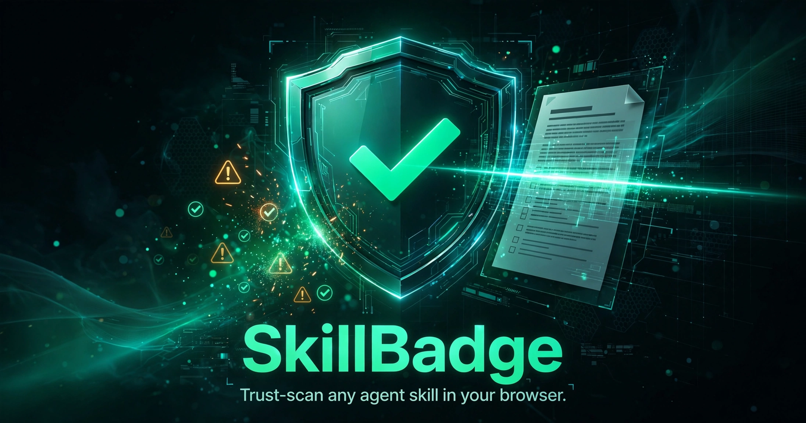

# SkillBadge 🛡️

[](LICENSE)
[](https://devilking7x.github.io/skillbadge/)
[](#)

**Is that `SKILL.md` safe to install?** SkillBadge is an in-browser trust scanner for AI agent skills. Paste or drag & drop any `SKILL.md` file and get an instant heuristic security scan — prompt-injection phrases, exfiltration URLs, `curl | bash` pipes, credential harvesting, base64 blobs, obfuscated code, destructive shell commands, hardcoded secrets, and more.

🔗 **Live demo:** https://devilking7x.github.io/skillbadge/

## ✨ Features

- **20 heuristic security checks** — prompt-injection / instruction overrides, secrecy directives, credential harvesting language, known exfiltration & drop domains (Discord webhooks, webhook.site, ngrok…), raw IPs in URLs, `curl|bash` / `wget|sh` pipes, `rm -rf` (escalated to critical for `/`, `~`, `$HOME` targets), dangerous `chmod`, `sudo` escalation, `eval`/`exec`, base64 blobs, obfuscated code (`\x` escapes, `fromCharCode`, `atob`, reversed strings), hardcoded secrets (Stripe/OpenAI/GitHub/AWS key patterns, private keys), env & shell-history snooping, reverse-shell primitives, persistence mechanisms (cron, systemd, rc files), sensitive local paths, URL-encoded links, plain-HTTP URLs, and missing frontmatter.
- **Trust score + verdict** — 0–100 score with TRUSTED / CAUTION / SUSPICIOUS / DANGEROUS verdicts, each finding graded critical / warning / info with plain-English explanations and exact line-number matches.
- **Shareable SVG badge** — generate a shields-style "scanned" badge with one click, plus copy-paste Markdown and HTML embed snippets for your README.
- **CI-friendly JSON report** — downloadable report with an explicit `ci.fail` flag and threshold, ready to gate your pipeline on untrusted skills.
- **Scan history** — every scan is stored in `localStorage`; re-view or delete past scans anytime.
- **Bundled demo samples** — one click loads a clean skill, a deliberately shady skill, or a borderline one, so you can see the scanner in action instantly.
- **100% client-side** — no uploads, no servers, no tracking. Your files never leave the browser.

## 🚀 How to use

1. Open the [live demo](https://devilking7x.github.io/skillbadge/).
2. **Paste** a `SKILL.md`, **drag & drop** the file, or click a **demo sample** (clean / shady / borderline).
3. Review the trust score, verdict, and findings (filter by severity, expand for line-level matches).
4. Switch to the **Badge** tab to download your SVG badge and copy the README snippet, or the **JSON report** tab for the CI-ready report.

### Local development

```bash
pnpm install
pnpm dev      # http://localhost:5173/skillbadge/
pnpm build    # outputs to dist/public
```

## 🛠️ Tech stack

- **TypeScript** + **React 19** + **Vite 7**
- **Tailwind CSS v4** (dark premium theme, Space Grotesk + JetBrains Mono)
- **lucide-react** icons
- Zero backend — static build deployed to GitHub Pages

## ⚠️ A note on heuristics

SkillBadge detects *patterns*, not *intent*. A flagged skill isn't automatically malicious (a DevOps skill may legitimately use `curl`), and a clean scan isn't a guarantee of safety. Always review flagged findings manually before installing a skill you don't fully trust.

## 📄 License

MIT — see [LICENSE](LICENSE).
